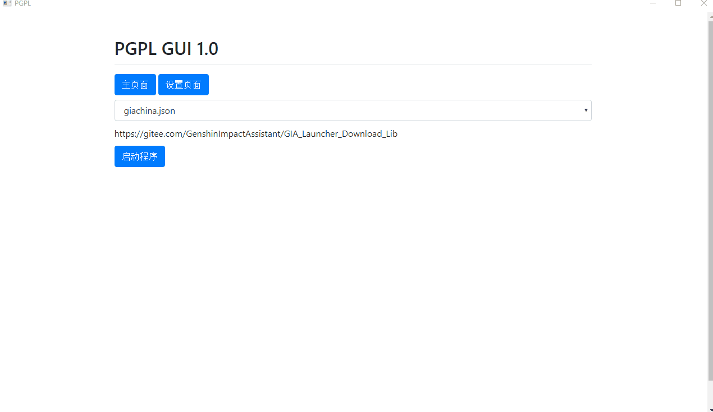

# python-git-program-launcher
自动安装并启动基于git管理的python程序。

# 特点
- 一键启动python程序，~~终极傻瓜包~~
- 使用git自动更新仓库
- 基于pywebio, webview和pyqt的GUI界面
- 允许使用不同的配置，管理不同python版本的不同仓库。
- 允许启动多个程序。
- 自动下载并安装python和pip包。
- 从Github仓库自动下载预配置文件
- 丰富的的自定义配置

# 使用

## 直接运行
下载最新的Release。

运行Launcher.bat或Launcher.exe。

你可能需要使用管理员权限运行。

***不要打开除了Watt Toolkit之外的所有可能干扰网络连接的软件，包括Clash/部分游戏加速器/网络连接管理/下载加速器等，它们会干扰SSL验证。***

## 源代码运行
克隆仓库。

运行`git submodule init; git submodule update`

运行Launcher.bat或Launcher.exe。

# 添加配置

## 从Github自动下载
如果你要添加的仓库有pgpl.yaml文件，你可以在添加配置时输入Github仓库地址，从而自动下载并识别远程仓库的配置文件。  
如果你在大陆，推荐使用Watt Toolkit加速Github。***极其强烈不推荐使用Clash***，因为它会干扰ssl验证。

## 手动添加
按照软件内说明操作。同时按照`设置配置`中的说明填写。

# 故障排查
频繁出现的故障：
1. 使用了网络代理软件导致ssl验证错误。**必须关闭Clash/游戏加速器/网络连接管理/下载加速器**
2. 没有启用长路径支持导致路径超过上限。你可以运行EnableLongPath.reg解决此问题。如果你不信任该文件，你可以在如下链接中找到相同解决方案。  
https://learn.microsoft.com/en-us/windows/win32/fileio/maximum-file-path-limitation?tabs=registry#enable-long-paths-in-windows-10-version-1607-and-later

请注意，该方法仅支持Windows10-1607之后的版本。

# 设置配置

|配置项|内容|默认值|
|----|----|----|
|RequirementsFile|requirement文件位置|requirements.txt|
|InstallDependencies|是否安装pip依赖|true|
|PypiMirror|pypi镜像地址|AUTO|
|PythonMirror|python镜像地址|AUTO|
|Repository|仓库地址|https://github.com/infstellar/python-git-program-launcher|
|Main|python执行文件|main.py|
|Branch|分支|main|
|GitProxy|是否开启Git验证|false|
|KeepLocalChanges|是否保持本地更改|false|
|AutoUpdate|是否自动更新|true|
|Tag|tag，有tag时优先使用tag，否则使用branch。||
|PythonVersion|python版本，必须为有效版本(3.x.y)|3.10.10|

# TODO:
- GUI

# 文件位置

## 日志位置
./Logs/yyyy-mm-dd/yyyy-mm-dd.log

## 仓库保存位置
./repositories

## python保存位置
./toolkit/python

## 缓存位置
./cache

# 范例配置

[SRC](configs/SRC-dev.json)   
[GIA](configs/giachina.json)  

# 鸣谢
ALAS-EasyInstaller  
GIA  
pywebio  
pywebview  
pyqt  
loguru  